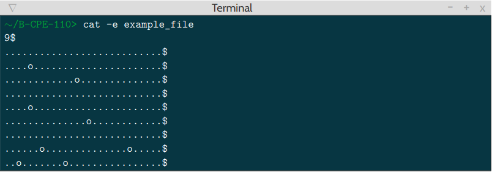
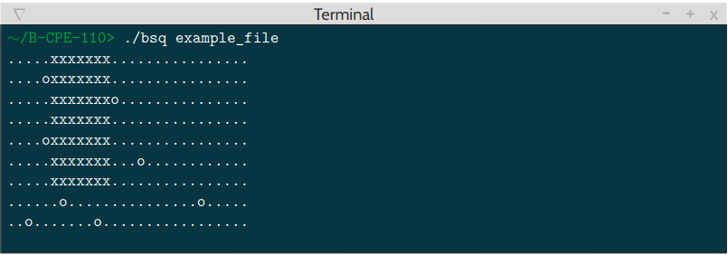

# CPE_BSQ_2019

BSQ find the largest possible square on a board while avoiding obstacles.

The board is represented by a file passed as the program’s argument. The file is valid if it is respecting those
constraints:

- its first line contains the number of lines on the board (and only that),

- **"."** (representing an empty place) and **"o"** (representing an obstacle) are the only two characters for the
other lines,

- all of the lines are of the same length (except the first one),

- it contains at least one line,

- each line is terminated by **"\n"**.

>The program print the board, with some **"."** replaced by **"x"** to represent the largest square you found

## Compile

The project compile with *Makefile*:

For compile the project use the commande:

```console
foo@bar:~/CPE_BSQ_2019$ make re
```

For clean the project use:

```console
foo@bar:~/CPE_BSQ_2019$ make fclean
```

Get instruction with:


```console
foo@bar:~/CPE_BSQ_2019$ ./bsq
```


## Example:


